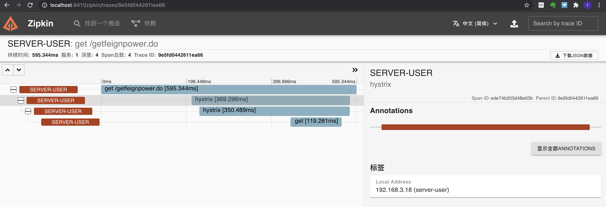

# spring-cloud-demo
该工程为spring-cloud的一个学习demo，主要使用到的技术点有Eureka、Ribbon、Hystrix、Zuul、Feign、Hystrix Dashboard、spring-cloud-config
- Eureka: 注册中心
- Ribbon: 用于客户端负载均衡
- Hystrix: 用于服务熔断、降级、限流
- Zuul: 微服务网关
- Feign: 声明式的WebService客户端，让微服务之间的调用更简单
- Hystrix Dashboard: Hystrix监控仪表盘
- spring-cloud-config: 分布式配置中心

****************

## 前言
1. 本项目中的spring-cloud版本为**Hoxton.SR9**， spring-boot版本为**2.3.5.RELEASE**
2. 当前demo下的各个集群都是在单机机器下通过不同的端口来模拟的集群，所以微服务多了之后，机器性能就有点吃不消，故后期只启动了单机版的Eureka，如果需要启动
集群版的Eureka，需要在本机的hosts文件中添加以下内容，Windows环境下的路径`C:\Windows\System32\drivers\etc\hosts`

```bat
127.0.0.1 eureka3000.com
127.0.0.1 eureka3001.com
127.0.0.1 eureka3002.com
```

至于详细的配置，可以参见eureka-server3000这个Module中的application.yml中的配置说明，这个配置中的注释比较全面。
> 同理：本学习demo中的任何一个集群环境，都是第一个Module中的注释比较全面，集群中其他Module都是copy第一个Module而来的，后期可能都是直接修改了第一个Module而没有同步到其他Module。
> 比方说：power微服务集群中，power中的注释就比power*中的注释详细

****************

## Module简介
- eureka-server3000: Eureka集群的机器之一，端口为3000
- eureka-server3001: Eureka集群的机器之一，端口为3001
- eureka-server3002: Eureka集群的机器之一，端口为3002
- order: 微服务集群（模拟【订单】微服务），端口为6000
- order1: 微服务集群（模拟【订单】微服务），端口为6001
- power: 微服务集群（模拟【权限】微服务），端口为7000
- power1: 微服务集群（模拟【权限】微服务），端口为7001
- power2: 微服务集群（模拟【权限】微服务），端口为7002
- user: 微服务集群（模拟【用户】微服务），端口为5000，同时他也是这个工程下的客户端角色，调用power/order等微服务。**该工程下有Feign、Ribbon、Hystrix的使用案例**
- zuul: Zuul对外暴露的地址，端口为8000，可以理解为Zuul集群的一个路由地址，客户端通过调用这个地址路由到zuul集群，zuul集群再根据路由配置路由到真实的服务地址，完成调用
- zuul-server8001: Zuul服务端集群的机器之一，端口为8001
- zuul-server8002: Zuul服务端集群的机器之一，端口为8002
- hystrix-dashboard: 微服务监控仪表盘，端口为8090，访问地址: http://localhost:8090/hystrix
- config-server9000: spring-config配置中心集群的机器之一，端口为9000
- config-server9001: spring-config配置中心集群的机器之一，端口为9001
- config-file: spring-cloud-config使用的配置文件（懒得在github上新建一个repository，故就在当前学习demo下新建一个目录当做远程配置仓库）

## Zipkin Server
### 搭建Zipkin Server
由于高版本的zipkin已经不支持自定义服务器,[官网](htts://zipkin.io)也建议通过docker的方式启动,故安装好docker之后,执行下面一条命令即可一键搭建zipkin
`docker run --name zipkin -d -p 9411:9411 openzipkin/zipkin`
最终界面如下图所示:


### 集成Zipkin Server
1. 在需要追踪的微服务pom文件中添加以下依赖
```xml
<dependency>
  <groupId>org.springframework.cloud</groupId>
  <artifactId>spring-cloud-starter-sleuth</artifactId>
</dependency>
<dependency>
  <groupId>org.springframework.cloud</groupId>
  <artifactId>spring-cloud-starter-zipkin</artifactId>
</dependency>
```
2. 在对应的application.yml文件中添加以下配置
```yaml
spring:
  zipkin:
    base-url: http://localhost:9411  #指定Zipkin server地址
  sleuth:
    sampler:
      probability: 1.0  #request采样的数量 默认是0.1 也即是10%  顾名思义 采取10%的请求数据  因为在分布式系统中，数据量可能会非常大，因此采样非常重要。我们示例数据少最好配置为1全采样
```

### 指定zipkin持计划存储
`docker run --name zipkin -d -p 9411:9411 -e ES_HOSTS=http://192.168.3.18:9200 -e STORAGE_TYPE=elasticsearch openzipkin/zipkin`
`docker run --name elasticsearch -d -p 9200:9200 -p 9300:9300 -e "discovery.type=single-node" elasticsearch`